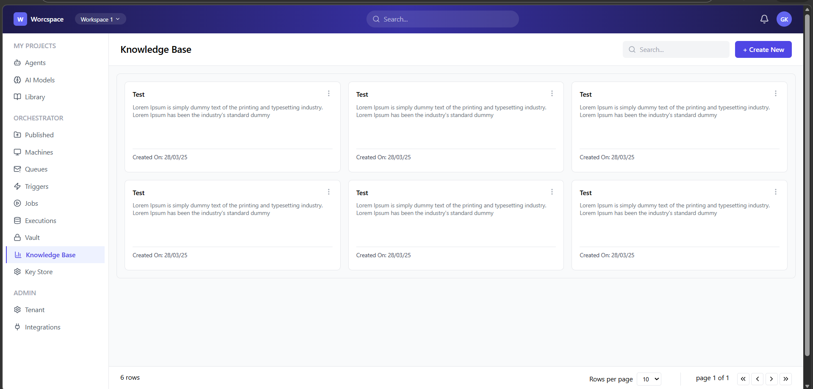
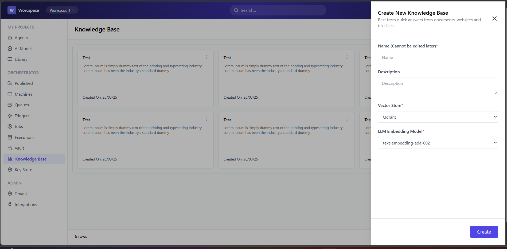

# 📘 Worcspace Knowledge Base UI

A responsive frontend application built using **React + Tailwind CSS**, replicating a Figma design for a Knowledge Base dashboard.


---
## 🚀 Live Demo Link

https://worcspace-ui.vercel.app/

---
## 📸 Screenshots

### 🏠 Home Screen


### ➕ Create Knowledge Base Modal


---

## ✨ Features

- Pixel-accurate UI based on design
- Sidebar navigation layout
- Header with search functionality
- Knowledge base cards grid
- Pagination bar
- "Create New" modal interaction

---

## 🧩 Tech Stack

- React (Functional Components + Hooks)
- Tailwind CSS
- Lucide Icons

---


## 🎯 Assignment Objective

This project was built as part of a frontend assignment to:

- Convert Figma design → React UI
- Maintain visual accuracy (spacing, colors, typography)
- Use reusable component architecture
- Ensure clean and maintainable code

---

## ⚙️ Setup Instructions

```bash
# Clone repo
git clone https://github.com/your-username/your-repo-name.git

# Install dependencies
npm install

# Run locally
npm run dev